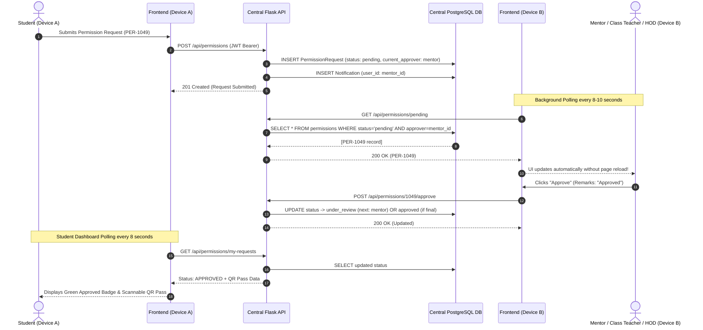

# Production Multi-User Cloud Architecture
## Dhondi Smart Permission & Faculty Management System

---

## 🌐 1. High-Level Production Architecture Diagram

```
                              INTERNET (HTTPS)
                                     │
           ┌─────────────────────────┴─────────────────────────┐
           ▼                                                   ▼
   STUDENT WEB CLIENT                                  STAFF WEB CLIENT
(Laptop / Mobile / Browser)                        (Teacher / Mentor / HOD)
   [React 18 + Vite SPA]                              [React 18 + Vite SPA]
           │                                                   │
           └─────────────────────────┬─────────────────────────┘
                                     │ HTTPS REST Calls
                                     │ Bearer JWT Auth & Polling (8-10s)
                                     ▼
                      ┌─────────────────────────────┐
                      │    CLOUD FRONTEND HOST      │
                      │  (Vercel / Netlify / Cloud) │
                      └──────────────┬──────────────┘
                                     │ HTTPS
                                     ▼
                      ┌─────────────────────────────┐
                      │     FLASK BACKEND (WSGI)    │
                      │     (Gunicorn on Render)    │
                      └──────────────┬──────────────┘
                                     │
         ┌───────────────────────────┼───────────────────────────┐
         ▼                           ▼                           ▼
┌──────────────────┐       ┌──────────────────┐       ┌──────────────────┐
│  AUTHENTICATION  │       │ WORKFLOW ENGINE  │       │  NOTIFICATIONS   │
│  - JWT Claims    │       │ - Student Chain  │       │  - Real-time DB  │
│  - Role RBAC     │       │ - Faculty Leave  │       │    Event Log     │
│  - Audit Logs    │       │ - Smart Sub Sub  │       │  - User Inbox    │
└────────┬─────────┘       └────────┬─────────┘       └────────┬─────────┘
         │                          │                          │
         └──────────────────────────┼──────────────────────────┘
                                    │
                                    ▼
                         ┌───────────────────────┐
                         │   QR PASS GENERATOR   │
                         │ (Encrypted Payload &  │
                         │ Base64 Digitized Pass)│
                         └──────────┬────────────┘
                                    │
                                    ▼
                         ┌───────────────────────┐
                         │    SQLALCHEMY ORM     │
                         │ (Connection Pooling & │
                         │   Auto-Reconnect)     │
                         └──────────┬────────────┘
                                    │ SSL / TLS (Port 5432)
                                    ▼
                         ┌───────────────────────┐
                         │   CENTRALIZED CLOUD   │
                         │  POSTGRESQL DATABASE  │
                         │ (Neon / Supabase /    │
                         │  Render Managed DB)   │
                         └───────────────────────┘
```

---

## 🔄 2. Real-Time Multi-Device Data Flow



---

## 👥 3. Multi-Tier Workflows & State Progression

### 3.1 Student Permission Workflow (Strict 3-Tier Hierarchy)
```
[STUDENT APPLIES]
       │
       ▼
[PENDING MENTOR]
       ├──► (Rejected) ──► [REJECTED] ──► No QR Generated
       │
       ▼ (Approved)
[PENDING CLASS TEACHER]
       ├──► (Rejected) ──► [REJECTED] ──► No QR Generated
       │
       ▼ (Approved)
[PENDING HOD]
       ├──► (Rejected) ──► [REJECTED] ──► No QR Generated
       │
       ▼ (Approved)
[FULLY APPROVED] ──► [DIGITAL QR PASS GENERATED] ──► Public Verification Enabled
```
> **Note**: The approval chain is DB-driven via `WorkflowConfig` and varies by type — e.g. `out_pass`/`personal`/`other` use *Mentor → Class Teacher → HOD*, while `medical` uses *Mentor → HOD* and `club_activity`/`college_event` use *Coordinator → HOD*.

### 3.2 Faculty Leave & Substitute Workflow
```
[FACULTY APPLIES (Specifies Time & Substitute Match)]
       │
       ▼
[PENDING COORDINATOR]
       ├──► (Rejected) ──► [REJECTED] ──► Notification to Faculty (HOD Bypassed)
       │
       ▼ (Approved)
[PENDING HOD]
       ├──► (Rejected) ──► [REJECTED] ──► Notification to Faculty
       │
       ▼ (Approved)
[FULLY APPROVED] ──► Timetable updated + Notification to Substitute & Faculty
```

---

## 🛡️ 4. Security & Isolation Model

1. **Centralized Data Isolation**: All users connect to one shared database, but access is restricted strictly by **role-based query filtering** and **JWT identity verification** on the server.
2. **QR Authenticity**: The QR code contains an unguessable pass number (`QR-XXXXXXXX`) and links to the public `/verify-pass/<pass_id>` endpoint. Rejected or pending permissions never have active QR pass records.
3. **Database Resiliency**: The SQLAlchemy engine uses `pool_pre_ping=True` to detect dropped connections and `pool_recycle=300` to refresh connections before cloud firewall timeouts.
